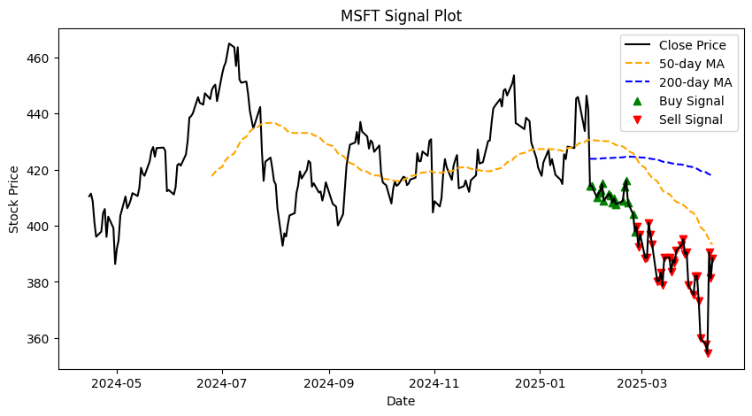

# 📈 Moving-Average-Crossover-Signals <a href="https://www.python.org/" target="_blank" rel="noreferrer"> **Python** </a>&nbsp;

This Python script generates **Buy** and **Sell** signals for stocks based on the classic **50/200 Simple Moving Average (SMA) crossover** strategy.

## 🧾 Description

The specific stocks analysed by default are the **Magnificent 7 (Mag 7): `GOOGL`, `AMZN`, `AAPL`, `META`, `MSFT`, `NVDA`, and `TSLA`.  
✏️ Want to Customize It? Just replace the stock tickers in the stocks_to_check list in the script. Everything else works out of the box.  

The core logic involves:
1.  Fetching dynamically the last year's worth of **daily adjusted close** price data from Yahoo Finance (`yfinance`).
2.  Calculating the 50-day and 200-day Simple Moving Averages (SMA).
3.  Generating **'Buy' signals** when the 50-day SMA crosses above the 200-day SMA.
4.  Generating **'Sell' signals** when the 50-day SMA crosses below the 200-day SMA.

The script then visualises the results, plotting the closing price, the SMAs, and clearly marking the generated Buy/Sell signals on the chart for each stock using `matplotlib`.

This project serves as a practical demonstration of implementing a basic trading signal strategy in Python. It uses historical daily data fetched dinamically from **Yahoo Finance (`yfinance`)**. As with any free data source, occasional inaccuracies might be present.  

## 🚀 Features

- Automatically downloads 1 year of historical price data for each stock.
- Calculates 50-day and 200-day simple moving averages.
- Generates **Buy** and **Sell** signals based on crossover strategy:
  - **Buy**: when 50-day MA crosses above 200-day MA
  - **Sell**: when 50-day MA crosses below 200-day MA
- Visualizes each stock's close price, moving averages, and buy/sell signals.
- Plots are generated for each stock individually.

## 📦 Requirements

* Access to **Google Colab** OR a local **Python 3.x** environment 
* Required Python libraries:
    * `yfinance`
    * `pandas`
    * `matplotlib`

## 🛠 Usage (in Google Colab)

1.  **Open the Notebook:**
    * Click the badge below to open this notebook directly in Google Colab:
      
2.  **Run the Cells:**
    * Once the notebook is open in Colab, run the code cells sequentially from top to bottom (you can use `Shift+Enter` or click the 'Run' button for each cell).
3.  **View Output:**
    * As the code runs, it will process each stock ticker. For each one, it will display a plot showing the price history, moving averages, and the calculated **Buy (^) and Sell (v) signals**.

## 📊 Example Output
  

-------------

*⚠️ Disclaimer: This tool is for educational and demonstration purposes only. The generated signals are based on a simple historical analysis and **do not constitute financial or investment advice**. Trading stocks involves significant risk.*  

### 🧑‍💻 Created by [tunjis](https://github.com/tunjis) 

-------------

* 🌍  Based in <a href="https://maps.app.goo.gl/hMxhRX5ptQAAkL7NA/" target="_blank">**London**</a>
* 🖥️  See my portfolio at [Data’s the new oil. I’m the refinery.](https://github.com/tunjis?tab=repositories)
* 📫  Contact me via my [LinkedIn profile](https://linkedin.com/in/justincraciun/)
* 🧠  Learning Data Science
* 🤝  Open to collaborating on interesting projects
* ⚡  AI enthusiast

-------------

### 🛠️ Technical Skills
<a href="https://www.python.org/" target="_blank" rel="noreferrer"> **Python** </a>&nbsp;
<a href="https://www.microsoft.com/en-us/microsoft-365/excel" target="_blank" rel="noreferrer"> **Microsoft Excel** </a>&nbsp;
<a href="https://www.mysql.com/" target="_blank" rel="noreferrer"> **MySQL** </a>&nbsp;
<a href="https://www.tableau.com/" target="_blank" rel="noreferrer"> **Tableau** </a>&nbsp;
<a href="https://powerbi.microsoft.com/" target="_blank" rel="noreferrer"> **Power BI** </a>&nbsp;  

<a href="https://azure.microsoft.com/" target="_blank" rel="noreferrer"> **Microsoft Azure** </a>&nbsp;
<a href="https://cloud.google.com/" target="_blank" rel="noreferrer"> **Google Cloud** </a>&nbsp;
&nbsp;&nbsp;  

-------------

### 🔁 Socials

<a href="https://www.github.com/tunjis/" target="_blank" rel="noreferrer">
  <picture>
    <source media="(prefers-color-scheme: dark)" srcset="https://raw.githubusercontent.com/danielcranney/readme-generator/main/public/icons/socials/github-dark.svg" />
    <source media="(prefers-color-scheme: light)" srcset="https://raw.githubusercontent.com/danielcranney/readme-generator/main/public/icons/socials/github.svg" />
    
  </picture>
</a>&nbsp;
<a href="https://linkedin.com/in/justincraciun/" target="_blank" rel="noreferrer">
  <picture>
    <source media="(prefers-color-scheme: dark)" srcset="https://raw.githubusercontent.com/danielcranney/readme-generator/main/public/icons/socials/linkedin-dark.svg" />
    <source media="(prefers-color-scheme: light)" srcset="https://raw.githubusercontent.com/danielcranney/readme-generator/main/public/icons/socials/linkedin.svg" />
    
  </picture>
</a>&nbsp;&nbsp;  

-------------

### ☕ Support Me

&nbsp;&nbsp;
